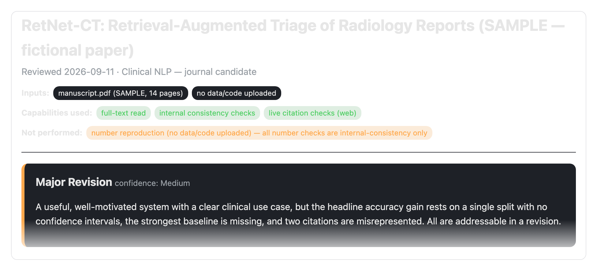
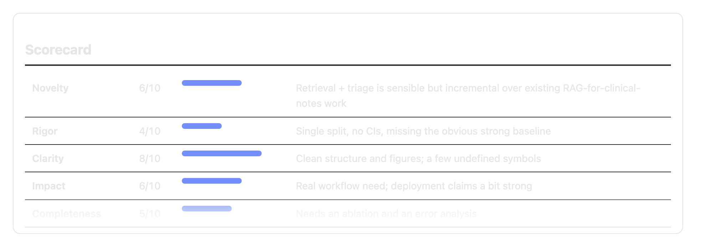
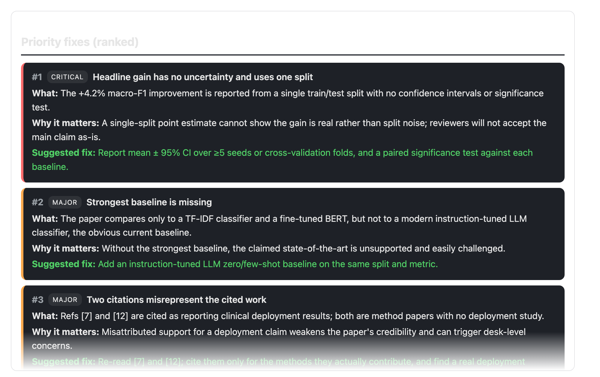
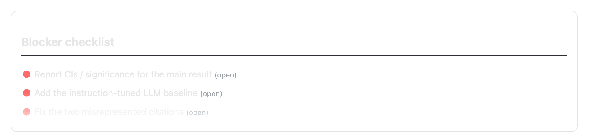
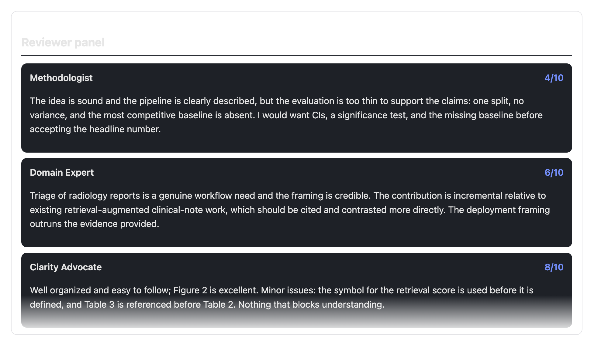
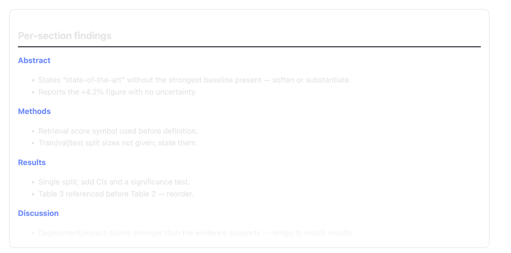
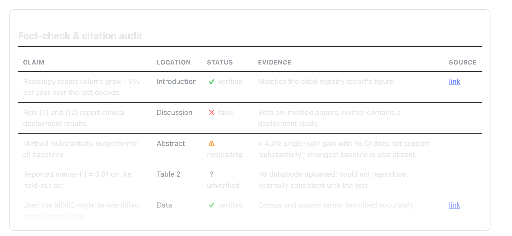
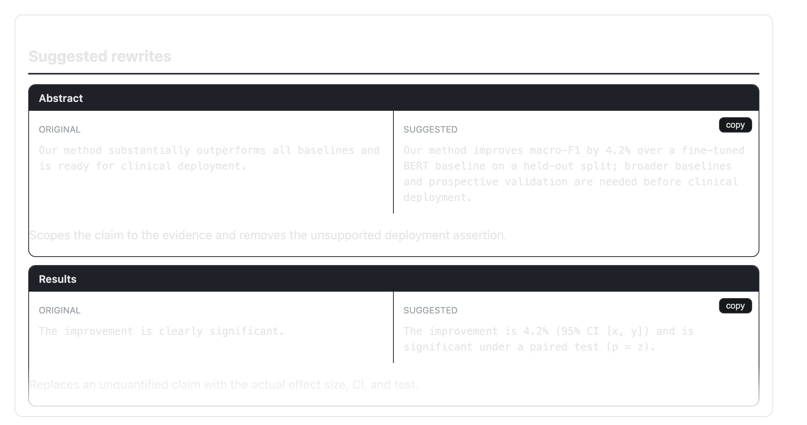
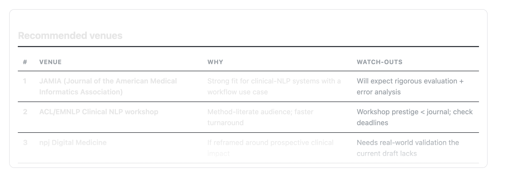

# How to read a Manuscript Review report

A review produces two things: a **ranked summary in the chat** and a **self-contained HTML
dossier** you can save and share. This guide walks through each part of the dossier.

> The screenshots below come from a review of a **fictional sample paper** ("RetNet-CT"), so the
> content is illustrative — your report will reflect your own manuscript. It's a rigorous first
> pass, not a replacement for expert review: verify its claims before acting.

---

## Header & verdict — what was reviewed, and the bottom line

- **Top:** the paper title and the **inputs** the tool saw.
- **Green** = capabilities it used; **orange** = what it *could not* verify (e.g. "no data uploaded,
  so numbers were not reproduced"). **Read the orange first** — it tells you what to trust.
- **Verdict:** the headline recommendation (accept → major/minor revision → reject), a confidence
  level, and a 2–3 sentence summary.

## Scorecard — where the work is

Five dimensions scored 1–10 (novelty, rigor, clarity, positioning/impact, completeness). Scan for
the **lowest bars** — that's where to spend your revision time.

## Priority fixes — the core of the report

Every issue, **ranked most-severe first**. Each card has a colored severity tag (**critical /
major / minor**) and three lines:

- **What** — the problem, precisely.
- **Why it matters** — the consequence if you don't fix it.
- **Suggested fix** (green) — a concrete action.

Work top-down: clear the critical/major cards before the minor ones.

## Blocker checklist — the must-clear list

The non-negotiable items distilled into a checklist, so you can track them to done.

## Reviewer panel — three perspectives

Three simulated reviewers — a **methodologist**, a **domain expert**, and a **clarity advocate** —
each scored. Like real panels, they can disagree; the disagreements are often the most useful part.

## Per-section findings — issues mapped to your paper

Smaller, local issues grouped by the section of your paper they occur in (Abstract, Methods,
Results, …), so they're easy to act on in order.

## Fact-check & citation audit — what checks out

Every load-bearing claim and citation with a status:

- **verified** — confirmed against a source.
- **misleading** — technically defensible but overstated.
- **false** — contradicted by the evidence (fix immediately).
- **unverified** — the tool *couldn't* check it (e.g. no data, or no web access) — this means
  "not checked," not "wrong."

## Suggested rewrites — copy-paste edits

Concrete **before → after** rewrites for weak or overstated sentences, ready to paste in.

## Recommended venues — where to send it

A ranked shortlist of venues that fit the paper's scope, each with a watch-out to weigh.

---

*Want to try it on your own draft? See the [install steps](../README.md#install-2-minutes).*
